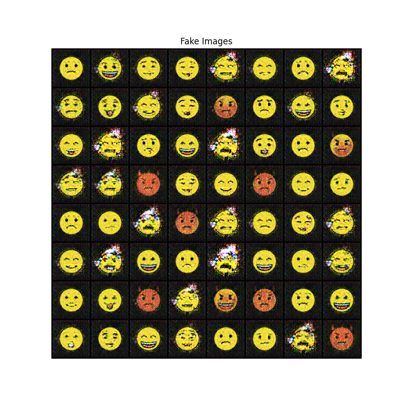
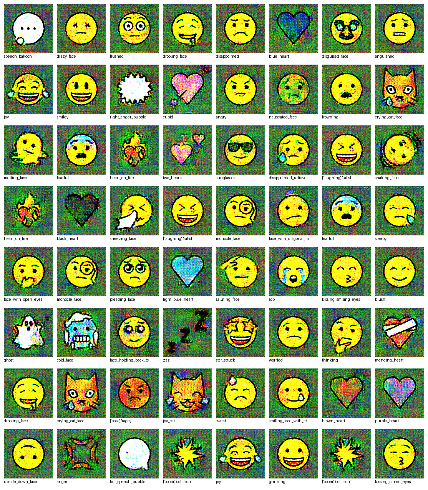
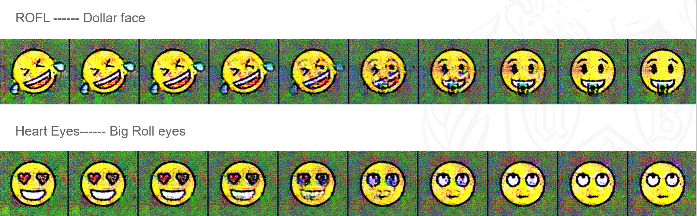
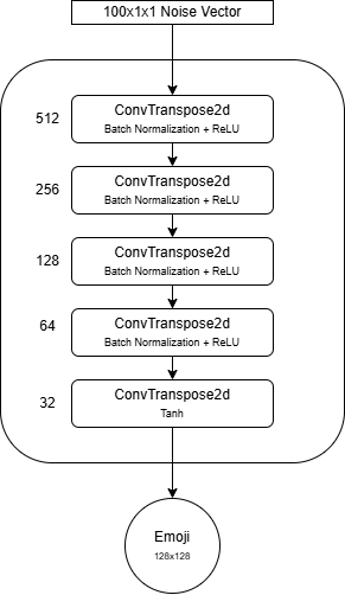
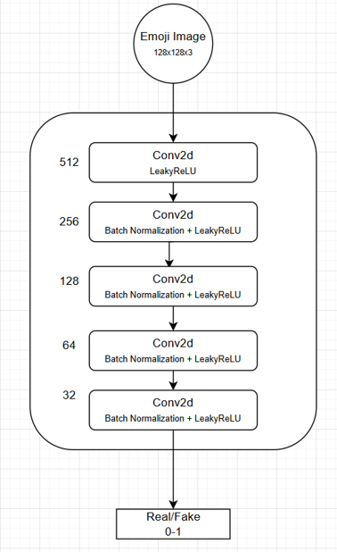

# Emoji Generation using Generative Adversarial Networks (GANs)

[](https://python.org)
[](https://pytorch.org)
[](https://jupyter.org)
[](LICENSE)

A comprehensive deep learning project for generating emoji images using DCGAN and Conditional GAN architectures. This repository contains the complete implementation, trained models, and results for both random and conditional emoji generation.

## 🎯 Project Overview

This project explores two main approaches to emoji generation:

- **Random Generation**: Using DCGAN to generate diverse emoji variations from noise
- **Conditional Generation**: Using Conditional GAN to generate specific emoji types based on labels


*Overview of the emoji generation pipeline*

## 🚀 Quick Start

### Prerequisites

- Python 3.7+
- PyTorch 1.9+
- CUDA-compatible GPU (recommended)
- Jupyter Notebook

### Installation

```bash
git clone https://github.com/yourusername/cvip-emoji-generation.git
cd cvip-emoji-generation/Submissions
pip install torch torchvision matplotlib numpy scikit-image pillow pandas
```

### Running the Project

1. **Random Generation**: Open `Random GAN generation/emoji-gen-cvip.ipynb`
2. **Conditional Generation**: Open `Conditional Generation/CVIP_final.ipynb`

## 📊 Results

### Random Generation Results

#### *Sample emojis generated using DCGAN*




### Conditional Generation Results

#### *Conditional generation results for different emoji types*



#### *Smooth interpolation between different emoji types*




### Model Architecture

*DCGAN Generator architecture diagram*



*DCGAN Discriminator architecture diagram*




## 📁 Repository Structure

```
root/
├── 📊 Main Files
│   ├── CVIP Project Report.pdf          # Comprehensive project report
│   ├── CVIP Project Slides.pptx         # Presentation slides
│
├── 🤖 Random GAN Generation/
│   ├── emoji-gen-cvip.ipynb            # Main training notebook
│   ├── generated_samples.png           # Generated emoji samples
│   ├── training_loss.png               # Training loss visualization
│   ├── final_weights.txt               # Model weights information
│   └── smileys/                        # Training dataset (108 images)
│
├── 🎯 Conditional Generation/
│   ├── CVIP_final.ipynb                # Conditional GAN notebook
│   ├── generator_128.pth               # Trained generator weights
│   ├── discriminator_128.pth           # Trained discriminator weights
│   ├── idx_to_shortcode.json          # Emoji label mapping (166+ categories)
│   ├── metadata128_updated.csv         # Dataset metadata
│   ├── smiley_ccr_128.zip             # 128x128 emoji dataset
│   └── epoch_200.png                   # Generated samples at epoch 200

```

## 🔧 Technical Implementation

### Problem Statement
This project aims to develop a generative model that understands the distribution of existing emojis in latent space and produces entirely new, unique emoji designs. The main focus is implementing Deep Convolutional Generative Adversarial Networks (DCGANs) as the core architecture for emoji generation, as GANs are very efficient in generating high-quality and sharper-looking emojis.

### Dataset Details
- **Source**: OpenMoji dataset (https://openmoji.org/)
- **Selection**: 108 yellow face smileys (😂🤔😎 etc.) representing expressive human-like facial expressions
- **Format**: PNG images with black background (manually converted from transparent)
- **Resolution**: 64×64×3 for DCGAN, 128×128×3 for Conditional GAN
- **Categories**: Happiness, sadness, surprise, anger, and various emotional expressions

### Random Generation (DCGAN)

#### Generator Network
- **Input**: 100-dimensional random noise vector (sampled from normal distribution)
- **Output**: 64×64×3 RGB emoji image
- **Architecture**: 5-layer transposed convolution network
- **Channel Progression**: 512 → 256 → 128 → 64 → 3
- **Activations**: ReLU + Batch Normalization (except final layer), Tanh (output)
- **Purpose**: Transform low-dimensional noise into high-resolution emoji images

#### Discriminator Network
- **Input**: 64×64×3 RGB emoji image
- **Output**: Probability of image being real (0-1)
- **Architecture**: 5-layer CNN with 4×4 kernels
- **Activations**: LeakyReLU + Batch Normalization (except first/last), Sigmoid (output)
- **Purpose**: Binary classifier distinguishing real vs generated emojis

#### Training Configuration
- **Optimizer**: Adam (β1=0.4, β2=0.999)
- **Learning Rates**: Generator: 0.00015, Discriminator: 0.000105
- **Batch Size**: 16
- **Epochs**: 500
- **Loss Function**: Binary Cross-Entropy (BCE)
- **Strategy**: Discriminator learns slower than generator to prevent gradient loss

### Conditional Generation (Conditional DCGAN)

#### Architecture Details
- **Generator**: 100D noise + 50D class embedding → 150D combined vector
- **Discriminator**: Image + class label embedding (concatenated along channels)
- **Output Resolution**: 128×128×3 RGB images
- **Class Embedding**: 50-dimensional learned embeddings
- **Categories**: 166+ different emoji types with text-based shortcode labels

#### Training Configuration
- **Optimizer**: Adam
- **Learning Rate**: 4×10⁻⁴
- **Batch Size**: 16
- **Epochs**: 200
- **Loss Function**: Binary Cross-Entropy with Label Smoothing
- **Regularization**: Soft labels (0.9 for real, 0.1 for fake) to prevent overconfidence

### Loss Functions

#### Discriminator Loss
```
L_D = -[log(D(x)) + log(1 - D(G(z)))]
```
Where:
- D(x): Discriminator prediction for real image x
- G(z): Generated emoji from noise z
- D(G(z)): Discriminator prediction for generated image

#### Generator Loss
```
L_G = -log(D(G(z)))
```
The model trains to make D(x) close to 1 and D(G(z)) close to 0.

## 🚀 Usage

### Training Models

#### Random Generation (DCGAN)

```bash
cd "Random GAN generation"
jupyter notebook emoji-gen-cvip.ipynb
```

#### Conditional Generation

```bash
cd "Conditional Generation"
jupyter notebook CVIP_final.ipynb
```

### Using Pre-trained Models

- **Random Generation**: Model weights available via Buffalo Box (see `final_weights.txt`)
- **Conditional Generation**: Load `generator_128.pth` and `discriminator_128.pth`

## 📈 Evaluation Metrics

### Training Analysis

#### GAN Loss Progression
The training showed 3 distinct phases:
- **Early Stage (0-200 iterations)**: Highly unstable, generator loss reaching up to 6
- **Middle Stage (200-400 iterations)**: More stable, generator loss ~1-1.5, discriminator loss ~0.5-1
- **Later Stage (400-1400 iterations)**: Both losses fluctuated between 0.5-2.5 but remained controlled

#### SSIM Quality Improvement
- **Rapid Improvement (0-25 epochs)**: SSIM jumped from 0.00 to 0.15
- **Stabilization (25-100 epochs)**: SSIM hovered around 0.14-0.15
- **Gradual Improvement (100+ epochs)**: SSIM reached peak of 0.24 around epoch 140

### Generated Sample Analysis

#### Strengths
- **Feature Diversity**: Generated images combined broad mix of visual features from training data
- **Global Structure**: Successfully captured high-level features like round and yellow shapes
- **Pattern Recognition**: Model understood global structural patterns of emojis

#### Weaknesses
- **Noise Presence**: Significant noise observable in generated outputs
- **Partial Features**: Some key features only partially present (e.g., face with clouds emoji)
- **Spatial Awareness**: Lack of spatial awareness that could be enhanced with attention modules

### Quantitative Analysis

#### Color Distribution
- **Limited Spectrum**: Dense cluster of colors within narrow spectrum
- **Low Diversity**: Results in visually similar outputs
- **Expected Behavior**: Due to limited color palette (yellow, red, black, white)

#### Feature Variance
- **Left-Skewed Distribution**: High variance at low values
- **Similar Patterns**: Images mostly similar looking with little variation
- **Controlled Generation**: Shows some controlled variation without being too spread out

#### Distance Analysis
- **Bell-Shaped Distribution**: Pairwise distances peak around 25-30
- **Moderate Distinctness**: Images moderately distinct from each other
- **Controlled Variation**: Shows controlled variation without being too spread out

#### Edge Quality
- **Soft Edges**: Edge magnitudes range between 0.11-0.12
- **Reduced Sharpness**: Produces soft and subtle edges
- **Visual Clarity**: Can make images look less sharp

#### Dimensionality Reduction
- **PCA Visualization**: Dense circular cluster centered around (0,0)
- **Low Variance**: PCA difficulty capturing complex structure
- **t-SNE Visualization**: Dense cluster with slightly more even spread
- **No Clear Clusters**: Samples remain quite similar in feature space

### Results Summary


*Comprehensive evaluation of model performance*


*GAN loss progression showing three distinct training phases*


*SSIM quality improvement over training epochs*


*PCA and t-SNE visualization of learned latent space*

## 🎯 Conditional Generation Results

### Label-Based Generation
The conditional GAN successfully generates specific emoji types based on text labels:


*Examples of label-controlled emoji generation*

- **Kissing Heart Emoji**: Generated from "kissing_heart" label
- **Winking Emoji**: Generated from "wink" label  
- **Crying Cat Face**: Generated from "crying_cat_face" label

### Latent Space Interpolation
Smooth transitions between different emoji types in the learned latent space:


*Smooth interpolation between different emoji types*

- **Heart Eyes → Big Roll Eyes**: Gradual transition between expressions
- **Smiley → Star Struck**: Morphing between different emotional states

### Training Stability
- **Label Smoothing**: Improved training stability using soft labels (0.9/0.1)
- **Controlled Generation**: 166+ different emoji categories supported
- **High Resolution**: 128×128 pixel output quality
- **Text-to-Emoji**: Direct mapping from shortcode labels to generated emojis

## 🎯 Key Features

- ✅ **Random Emoji Generation**: DCGAN-based diverse emoji synthesis
- ✅ **Conditional Generation**: Label-controlled emoji creation
- ✅ **High Resolution**: 128x128 pixel output for conditional generation
- ✅ **Multiple Categories**: Support for 166+ different emoji types
- ✅ **Smooth Interpolation**: Latent space transitions between emoji types
- ✅ **Comprehensive Evaluation**: SSIM tracking and visual analysis

## 📚 Documentation

- **`CVIP Project Report.pdf`**: Detailed methodology, implementation, and results
- **`CVIP Project Slides.pptx`**: Presentation slides with key findings
- **Notebooks**: Self-contained Jupyter notebooks with complete implementations

## 🔬 Research Applications

This project demonstrates several important concepts in generative modeling:

- **GAN Training Stability**: Techniques for stable adversarial training
- **Conditional Generation**: Label-controlled image synthesis
- **Latent Space Exploration**: Understanding learned representations
- **Evaluation Metrics**: SSIM and visual quality assessment
- **Interpolation**: Smooth transitions in learned latent spaces

## 🚀 Future Work

Based on the project findings, several areas for improvement and extension have been identified:

### Immediate Improvements
- **Text-Based Conditional Generation**: Generate emojis based on natural language prompts
- **Attention Mechanisms**: Add attention blocks to capture spatial awareness and improve feature localization
- **Expanded Dataset**: Include more emoji categories (humanoid emojis, hand gestures, etc.)

### Advanced Extensions
- **Multimodal Integration**: Integrate CLIP or similar models for text-image understanding
- **Higher Resolution**: Scale up to 256×256 or 512×512 pixel generation
- **Style Transfer**: Apply different artistic styles to generated emojis
- **Real-time Generation**: Optimize for real-time emoji generation applications

### Technical Enhancements
- **Better Loss Functions**: Implement Wasserstein GAN or other advanced loss functions
- **Progressive Training**: Use Progressive GAN techniques for higher quality generation
- **Data Augmentation**: Implement advanced augmentation techniques for better generalization
- **Evaluation Metrics**: Add FID (Fréchet Inception Distance) and other quantitative metrics

## 🤝 Contributing

This is an academic project submission. For questions or suggestions, please refer to the project report or contact the authors.

## 📄 License

This project is for educational purposes. Please respect the OpenMoji dataset license for any commercial use.

## 🙏 Acknowledgments

- OpenMoji dataset for providing the emoji images
- PyTorch team for the deep learning framework
- University at Buffalo CSE 573A course for project guidance

---
